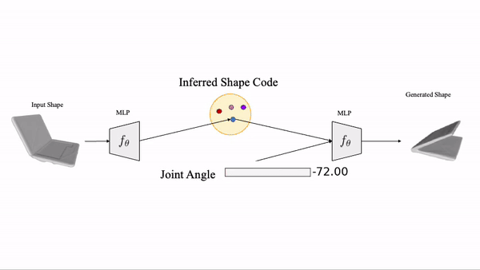

# A-SDF: Learning Disentangled Signed Distance Functions for Articulated Shape Representation (ICCV 2021)

This repository contains the official implementation for A-SDF introduced in the following paper: [A-SDF: Learning Disentangled Signed Distance Functions for Articulated Shape Representation (ICCV 2021)](https://arxiv.org/abs/2104.07645). The code is developed based on the Pytorch framework(1.6.0) with python 3.7.6. This repo includes training code and generated data from [shape2motion](http://motiondataset.zbuaa.com).

[**A-SDF: Learning Disentangled Signed Distance Functions for Articulated Shape Representation (ICCV 2021)**](https://arxiv.org/abs/2104.07645)
<br>
[*JitengMu*](https://jitengmu.github.io/), [*Weichao Qiu*](https://weichaoqiu.com/), [*Adam Kortylewski*](https://adamkortylewski.com/), [*Alan Yuille*](http://www.cs.jhu.edu/~ayuille/), [*Nuno Vasconcelos*](http://www.svcl.ucsd.edu/~nuno/), [*Xiaolong Wang*](https://xiaolonw.github.io/)
<br>
ICCV 2021

The project page with more details is at [https://jitengmu.github.io/A-SDF/](https://jitengmu.github.io/A-SDF/).

<div align="center">

</div>


## Citation

If you find our code or method helpful, please use the following BibTex entry.
```
@article{mu2021asdf,
  author    = {Jiteng Mu and
               Weichao Qiu and
               Adam Kortylewski and
               Alan L. Yuille and
               Nuno Vasconcelos and
               Xiaolong Wang},
  title     = {{A-SDF:} Learning Disentangled Signed Distance Functions for Articulated
               Shape Representation},
  journal    = {arXiv preprint arXiv:2104.07645 },
  year      = {2021},
}
```


## Data preparation and layout

Please 1) download [dataset](https://nextcloud.nautilus.optiputer.net/s/Ecr6ZHokBStAgST) and put data in the `data` directory, and 2) download [checkpoints](https://nextcloud.nautilus.optiputer.net/s/Ecr6ZHokBStAgST) and put the checkpoint in the corresponding `example/<category>` directory, e.g. it should look like `examples/laptop/laptop-asdf/Model_Parameters/1000.pth`.

The dataset is structured as follows, `<dataset_name>` can be, e.g. `shape2motion/shape2motion-1-view/shape2motion-2-view/rbo` :

```
data/
    SdfSamples/
        <dataset_name>/
            <class_name>/
                <instance_name>.npz
    SurfaceSamples/
        <dataset_name>/
            <class_name>/
                <instance_name>.ply
    NormalizationParameters/
        <dataset_name>/
            <class_name>/
                <instance_name>.ply
```

Splits of train/test files are stored in a simple JSON format. For examples, see `examples/splits/`. 

# How to Use A-SDF

Use the class laptop as illustration. Feel free to change to `stapler/washing_machine/door/oven/eyeglasses/refrigerator` for exploring other categories.


## (a) Train a model

To train a model, run
```
python train.py -e examples/laptop/laptop-asdf/
```


## (b) Reconstruction

To use a trained model to reconstruct explicit mesh representations of shapes from the test set, run the follow scripts, where `-m recon_testset_ttt` for inference with test-time adaptation and `-m recon_testset` otherwise.
```
python test.py -e examples/laptop/laptop-asdf/ -c 1000 -m recon_testset_ttt
```
To compute the chamfer distance, run:

```
python eval.py -e examples/laptop/laptop-asdf/ -c 1000 -m recon_testset_ttt
```

## (c) Generation

To use a trained model to genrate explicit mesh of unseen articulations (specified in `asdf/asdf_reconstruct.py`) of shapes from the test set, run the follow scripts. Note that `-m` mode should be consistent with the one for reconstruction: `-m generation_ttt` for inference with test-time adaptation and `-m generation` otherwise.
```
python test.py -e examples/laptop/laptop-asdf/ -c 1000 -m generation_ttt
```

```
python eval.py -e examples/laptop/laptop-asdf/ -c 1000 -m generation_ttt
```


## (d) Interpolation

To use a trained model to interpolate explicit mesh of unseen articulations (specified in `asdf/asdf_reconstruct.py`) of shapes from the test set, run:
```
python test.py -e examples/laptop/laptop-asdf/ -c 1000 -m inter_testset
```

```
python eval.py -e examples/laptop/laptop-asdf/ -c 1000 -m inter_testset
```


## (e) Partial Point Cloud

To use a trained model to reconstruct and generate explicit meshes from partial pointcloud: (1) download the partial point clouds dataset `laptop-1/2-view-0.025.zip` from [dataset](https://nextcloud.nautilus.optiputer.net/s/Ecr6ZHokBStAgST) first and (2) put the laptop checkpoint trained on shape2motion in `examples/laptop/laptop-asdf-1/2-view/`, (3) then run the following scripts, where `--dataset shape2motion-1-view` for partial point clouds generated from a single depth image and `--dataset shape2motion-2-view` for the case generated from two depth images of different view points, `-m` can be one of `recon_testset/recon_testset_ttt/generation/generation_ttt`, similar to previous experiments.
```
python test.py -e examples/laptop/laptop-asdf-1-view/ -c 1000 -m recon_testset_ttt/generation_ttt --dataset shape2motion-1-view
```

```
python eval.py -e examples/laptop/laptop-asdf-1-view/ -c 1000 -m recon_testset_ttt/generation_ttt
```


## (f) RBO dataset
To test a model on the [rbo dataset](https://tu-rbo.github.io/articulated-objects/): (1) download the generated partial point clouds of the laptop class from the rbo dataset --- `rbo_laptop_release_test.zip` from [dataset](https://nextcloud.nautilus.optiputer.net/s/Ecr6ZHokBStAgST) first, (2) put the laptop checkpoint trained on shape2motion in `examples/laptop/laptop-asdf-rbo/`, (3) then run the following,

```
python test.py -e examples/laptop/laptop-asdf-rbo/ -m recon_testset_ttt/generation_ttt -c 1000 --dataset rbo
```

```
python eval_rbo.py -e examples/laptop/laptop-asdf-rbo/ -m recon_testset_ttt/generation_ttt -c 1000
```

Dataset generation details are included in the 'dataset_generation/rbo'.


## Data Generation
Stay tuned. We follow (1) [ANSCH](https://github.com/dragonlong/articulated-pose) to create URDF for shape2motion dataset,(2) [Manifold](https://github.com/hjwdzh/Manifold) to create watertight meshes, (3) and modified [mesh_to_sdf](https://github.com/marian42/mesh_to_sdf) for generating sampled points and sdf values.

## Acknowledgement

The code is heavily based on Jeong Joon Park's [DeepSDF](https://github.com/facebookresearch/DeepSDF) from facebook.
